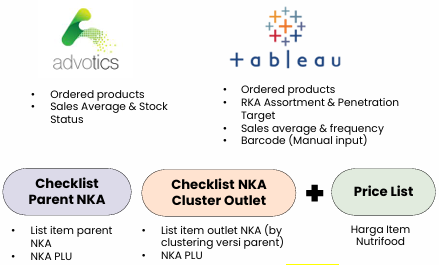

# Project CLUE: Enterprise Retail Data Standardization & Operational Checklist Integration

> **Confidentiality & Data Protection Notice:** To comply with corporate Non-Disclosure Agreements (NDA), all proprietary product stock parameters, specific distributor branch domains, and retail partner account names have been sanitized, anonymized, or masked using generic identifiers. The core business process re-engineering (BPR) architecture, operational logic, and systems integration frameworks remain fully authentic.

---

## Project Overview
- **Project Name:** Project CLUE (Check List Update – Enhanced)
- **Objective:** Re-engineer a highly fragmented retail monitoring architecture to systematically prevent Out-of-Stock (OOS) risks and maximize modern trade distribution efficiency.
- **Root Problem:** Severe data silos across **5 disparate operational tools** causing a 22% delay in store-level fulfillment and a projected lost sales window valued at **IDR 328.3 Million**.
- **Key Methodologies:** Business Process Re-engineering (BPR), SCAMPER System Ideation, Cross-Platform Database Integration (ERP to Field Applications), Assortment Optimization

---

## The Enterprise Challenge (Situation & Task)
Field sales execution teams (Merchandisers & Salesmen) frequently face operational bottlenecks when data is scattered across independent pipelines. In this specific FMCG modern trade framework, tracking a single retail outlet required checking 5 completely isolated systems:
1. **Advotics App:** Monitored historical shipments and generic stock indicators.
2. **Checklist Tabi (Paper-Based):** Manual logs tracking regional account targets.
3. **Checklist SO (Paper-Based):** Form-based records managing regional parent rules.
4. **Key Account Management (KAM) Matrix:** Fragmented offline spreadsheets detailing customized store assortment clusters.
5. **Master Price List:** Standard cost directories maintained manually outside field tools.

This extreme data fragmentation led to catastrophic operational blind spots. Field teams could not verify in real-time whether a newly listed corporate product SKU had actually been ordered by a regional store branch. Audit arrays revealed that **22% of modern trade accounts experienced an administrative order gap of up to 6 months after an official product launch**, triggering a national lost sales vulnerability evaluated at **IDR 328,350,879**.

---

## System Re-Engineering & Database Consolidation (Action)

To eliminate data redundancy and secure fulfillment precision, the workflow was overhauled through a multi-stage integration roadmap driven by **SCAMPER systems thinking**:

### 1. Root-Cause Elimination & SCAMPER Ideation
- **Substitute:** Replaced slow, manual email-dependent checklist distribution sheets from central KAM offices with centralized automated data streaming.
- **Combine:** Consolidated the 5 scattered diagnostic directories into a single, unified database architecture.
- **Eliminate:** Removed manual data entry vulnerabilities by linking the system directly to the core Oracle ERP database, automatically pulling pre-existing Barcode and Product Line Unit (PLU) configurations.

### 2. Strategic Cluster Modeling
Instead of managing checklists manually for every single individual retail storefront, I introduced an automated **Store Clustering Master Model**. Outlets were dynamically grouped based on their central parent account parameters (e.g., *Farmers Market Cluster 2B, 3A, or Grand Lucky All*). Product listing or de-listing commands executed by Key Account Managers at the corporate headquarters now instantly propagate down to thousands of associated branch profiles in the field app.

### 3. Iterative Deployment (Checklist 1.0 to Integrated 2.0 Dashboard)
- **Checklist 1.0 Iteration:** Merged core SKU groups with automated Barcode mapping and integrated 3-month/12-month rolling historical sales volume averages to give field teams immediate sales velocity insights.
- **Integrated Checklist 2.0 Deployment:** Fully embedded national Key Account PLU numbers and live Master Price structures directly into the digital field layout. I implemented an analytical **Stock Level (SL) Monitoring System** governed by clear operational thresholds:
  $$\text{Stock Level} = \frac{\text{Current On-Hand Stock}}{\text{Average Sales Quantity}}$$
  This enabled the app to automatically flag inventory conditions (e.g., *Understock, Safe, or Volatile Overstock*), turning a passive checklist into an active, predictive ordering assistant.

---

## Technical Visual Gallery & System Architecture

### 1. Financial Impact Matrix (The Data-Driven Justification)
The initial diagnostic audit mapped the critical lag between corporate product launches and real-world store-level orders, providing the exact empirical foundation needed to justify the system overhaul:

### 2. Process Optimization Architecture (SCAMPER Framework)
Below is the system ideation matrix utilized to dissect the legacy pain points and plan the structural transitions from manual sheets to integrated enterprise tools:

### 3. Legacy Framework vs. Consolidated Solution
Legacy field operations forced salesmen to manage data across 5 highly fragmented, manual tools (left). Project CLUE consolidated this entire ecosystem into a single **Integrated Checklist 2.0 Interface** (right) built natively inside the enterprise platform:

| Fragmented Legacy Data Silos (5 Isolated Tools) | Consolidated Interface (Integrated Checklist 2.0 Grid) |
|---|---|
|  |  |

- **The Operational Impact:** Successfully compressed the field visit check routines from **5 separate steps down to 1 single synchronized screen**.
- **Fulfillment Precision:** Completely removed the human error loop from manual barcode inputs, ensuring **100% data alignment** between central corporate assortments and real-world store shelves.
- **Lead-Time Compression:** Drastically reduced the transition lag for new product fulfillment, protecting national supply chain margins from artificial out-of-stock gaps.

---

## Key Takeaway & Professional Competencies
This business process re-engineering project highlights my core strengths in enterprise operations and systems design:
- **Enterprise Architecture Consolidation:** Highly proficient in mapping chaotic, fragmented business operations and re-engineering them into clean, centralized database workflows that bridge corporate ERP systems with real-world field applications.
- **Supply Chain Risk Mitigation:** Experienced in designing quantitative operational indicators (such as rolling stock-level velocity ratios) to convert raw inventory datasets into proactive, automated logistics decisions.
- **Cross-Functional Stakeholder Alignment:** Skilled in coordinating process requirements between distinct corporate layers—aligning central Key Account Managers, backend IT database teams, and fast-moving field sales networks to achieve standardized execution KPIs.
