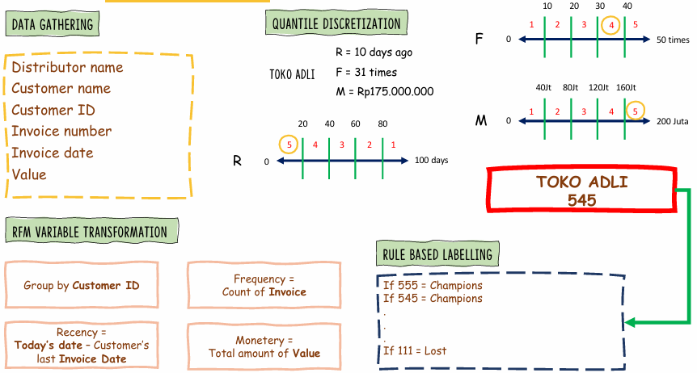
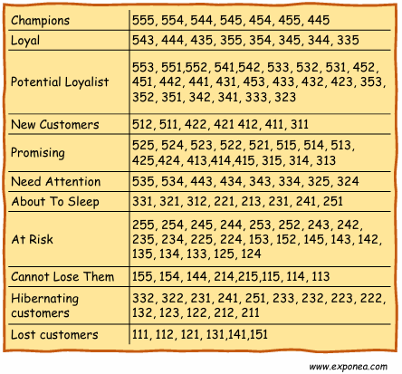
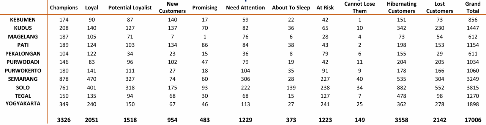

# Data-Driven Customer Segmentation via Computational RFM Modeling

> **Confidentiality & Data Protection Notice:** To comply with corporate Non-Disclosure Agreements (NDA), all specific B2B customer identities, distributor codes, and absolute revenue matrix parameters in this case study have been programmatically sanitized, anonymized, or scaled using a normalization multiplier. The core analytical methodologies, quantile discretization logic, and statistical distributions remain fully authentic.

---

## Project Overview
- **Objective:** Segment a massive, fragmented national FMCG B2B customer database into distinct behavioral clusters to maximize retention marketing efficiency.
- **Data Scale:** Analyzed a database tracking **17,006 national retail accounts** spanning multiple major regional distribution hubs.
- **Analytical Framework:** Recency, Frequency, Monetary (RFM) Behavior Analysis
- **Key Methodologies:** Data Wrangling & Aggregation, Statistical Quantile Discretization, Rule-Based Algorithmic Labeling

---

## The Business Challenge (Situation & Task)
In large-scale B2B distribution networks, a "one-size-fits-all" marketing and commercial strategy is highly inefficient. Corporate transaction logs capture millions of invoice data rows, but this data remains scattered, hidden, and underutilized. 

The challenge was to ingest a massive national multi-year transaction database, resolve data fragmentation by aggregating historical invoices at the individual account level, and execute a behavioral scoring framework. The ultimate goal was to identify hidden revenue risks, pinpoint highly valuable customers who were drifting away (*At Risk*), and provide localized sales teams with optimized, targeted retention blueprints.

---

## The Technical Core & Segmentation Framework (Action)

The data pipeline was engineered through a systematic three-stage behavioral transformation process:

### 1. Feature Engineering & Variable Transformation
Extracted raw, transactional line-item rows from the central database and grouped the data space by unique Customer IDs. I engineered three continuous behavioral metrics:
- **Recency ($R$):** The exact number of days between the baseline analysis date and the customer's most recent invoice date.
- **Frequency ($F$):** The absolute count of valid invoices issued to the account across the operational timeline.
- **Monetary ($M$):** The cumulative gross transaction value spent by the specific account.

### 2. Statistical Quantile Discretization
To eliminate scale bias and establish a standardized comparison framework, the continuous distributions of $R$, $F$, and $M$ were segmented into equal-sized statistical bins using a **5-bin quantile discretization array**:
- Each account received a score from 1 to 5 for each category (where 5 represents top-tier performance: the most recent, most frequent, and highest-spending accounts).
- This compressed the complex transaction histories of thousands of separate stores into a highly definitive, 3-digit behavioral profile (e.g., An account scoring **545** represents a top-tier client with high frequency and monetary value who ordered very recently).

### 3. Algorithmic Rule-Based Labeling
Mapped the resulting $5 \times 5 \times 5 = 125$ possible score combinations into **11 operational customer segments** based on empirical behavioral matrices (e.g., *Champions*, *Potential Loyalists*, *Need Attention*, *At Risk*, *Cannot Lose Them*, down to *Lost*).

---

## Technical Visual Gallery & Operational Results

### 1. The Variable Transformation and Quantile Array Pipeline
Below is the data engineering workflow utilized to systematically transform fragmented transactional metadata strings into structured algorithmic profiles:

### 2. Rule-Based Cluster Allocation Matrix
Accounts were automatically mapped into operational segments using a highly structured rule-based profiling index to isolate performance indicators:

### 3. Large-Scale Regional Distribution Output
The computational pipeline successfully categorized **17,006 regional B2B accounts** across 11 key distribution regions (including Semarang, Solo, Yogyakarta, and Surabaya). This allowed corporate strategy teams to transition from generic campaigns to highly precise operational actions:

- **The Strategic Impact:** By executing cross-sectional data comparisons, we discovered that **80% of our top-tier corporate "Champions"** were geographically concentrated within highly specific sub-districts. This allowed field sales operations to deploy optimized resources immediately. 
- **Actionable Retention:** Isolated high-value accounts that were slipping into the *At Risk* or *Cannot Lose Them* brackets, enabling regional teams to trigger proactive site visits, program renewals, and customized discount structures to maximize B2B customer lifetime value.

---

## Key Takeaway & Professional Competencies
This data architecture project showcases my ability to extract real corporate value from raw, unorganized databases:
- **High-Volume Data Wrangling:** Proficient in aggregating, structuring, and transforming massive, multi-row transactional databases into crisp, individual behavioral features without losing data integrity.
- **Algorithmic Profiling & Systems Thinking:** Experienced in designing rule-based statistical sorting models (Quantile Discretization) to turn chaotic background noise into perfectly grouped operational segments.
- **Data-Driven Strategy Formulation:** Focused on translating complex mathematical models into clear, actionable business solutions—ensuring that data insights directly optimize regional supply chains and sales efficiency.
